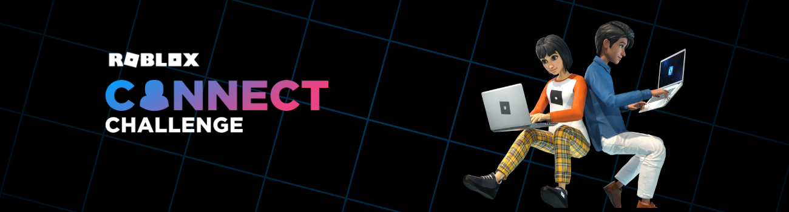
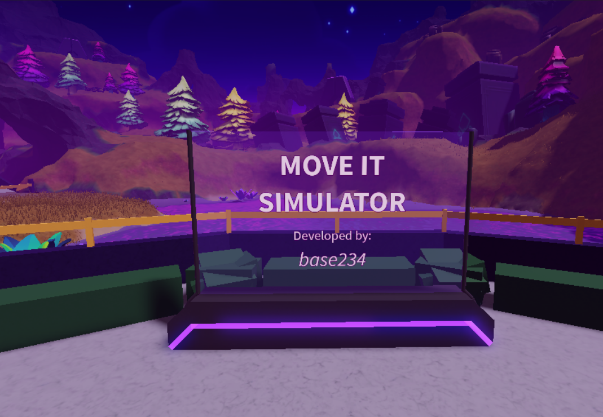
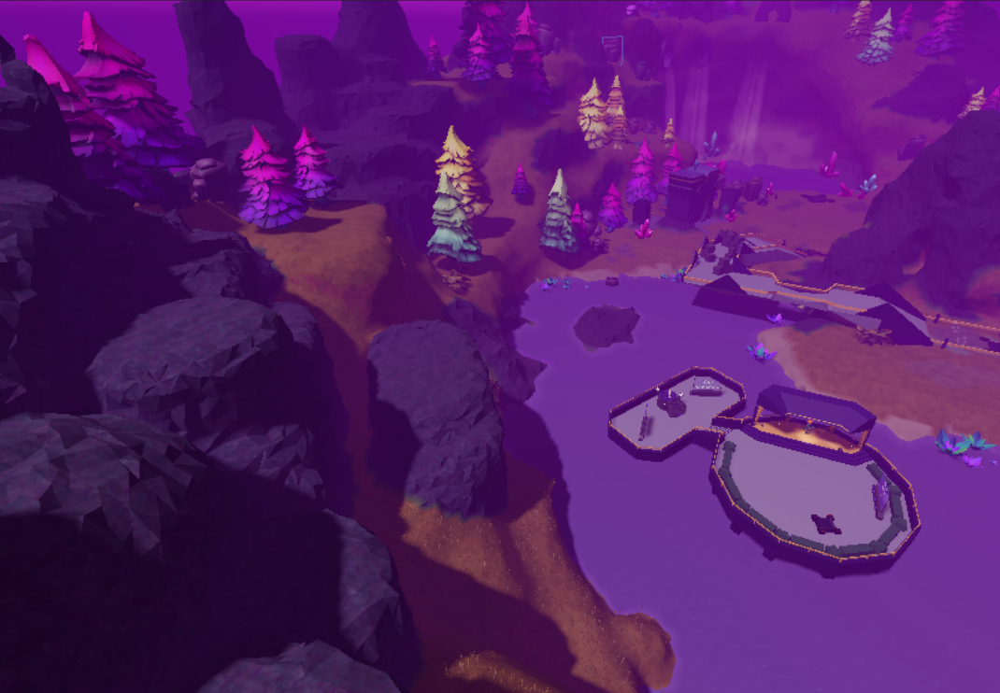
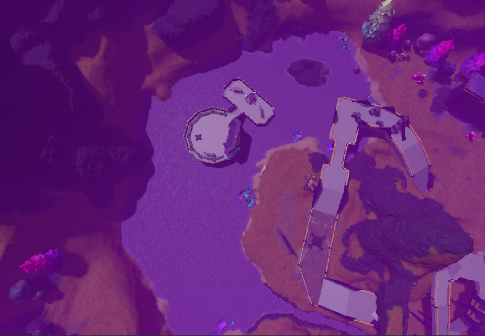

# Move-It-Simulator (Connect 2022 Challenge)

<a href="https://www.hackerearth.com/challenges/hackathon/connect-2022-challenge">https://www.hackerearth.com/challenges/hackathon/connect-2022-challenge</a>

## About
<ul>
  <li>Move It Simulator is an environment based interaction where you can roam and press move it to move through the entire world or with your device in your hand.</li>
  <li>Created using Roblox Studio.</li>
</ul>

### Demo Link: <a href="https://www.roblox.com/games/10343378186/Move-It-Simulator">https://www.roblox.com/games/10343378186/Move-It-Simulator</a>

## Screenshots

## Thank You
